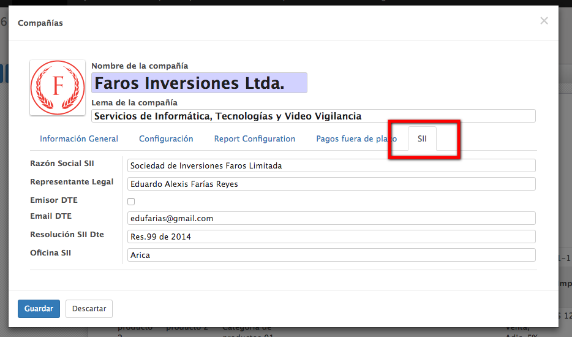
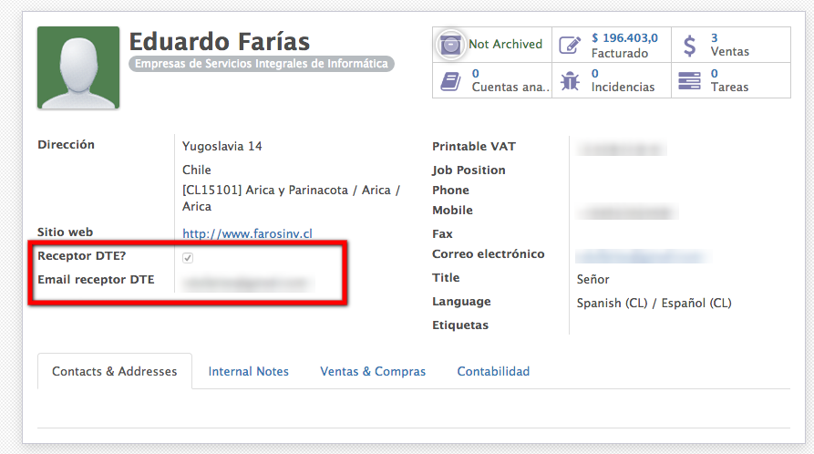
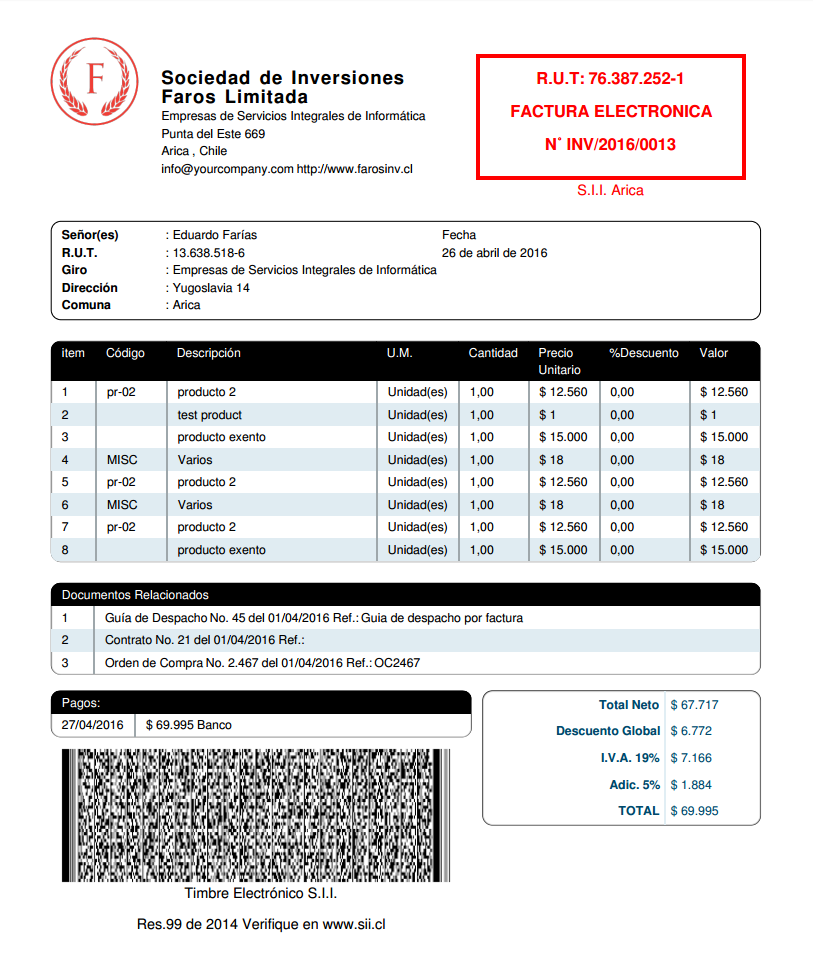

# Odoo - Generación de Documentos Tributarios Electrónicos Chile

## Summary
El objetivo de éste proyecto es el desarrollo de módulos para Odoo V9.0, para la emisión de documentos tributarios electrónicos de acuerdo a la legislación Chilena.

## Descripción
Siguiendo el enfoque de desarrollo ágil, con sprints semanales, se pretende implementar la emisión de *documentos tributarios electrónicos* _(DTE)_, de acuerdo a la legislación Chilena. Las principales funcionalidades serán:

### Funcionalidades 
  - [x] Agrega página de configuración de parámetros del SII a compañía
  
  - [x] Agrega campos para determinar si un partner es receptor de DTE's
  - 
  - [x] Agrega Descuento global a presupuestos, pedidos de venta y facturas a través del módulo [sale_global_discount](https://github.com/farosinv/sale_global_discount)
  - [x] Agrega Documentos relacionados a través del módulo [l10n_cl_inv_related_documents](https://github.com/farosinv/l10n_cl_inv_related_documents)
  - [ ] Factura Electrónica de Ventas y Servicios
    - [x] Factura Afecta a IVA (reporte PDF, timbre solo de prueba)
    - 
    - [ ] Factura Exenta de IVA
  - [ ] Emisión de DTE's
   - [ ] Boleta Electrónica
     - [ ] Boleta Afecta a IVA
     - [ ] Boleta Exenta de IVA
   - [ ] Notas de Crédito/Débito
   - [ ] Guías de Despacho
   - [ ] Libros Contables
     - [ ] Libro de Ventas
     - [ ] Libro de Compras
  - [ ] Recepción de DTE's de proveedores

Desarrollado por

http://www.farosinv.cl
